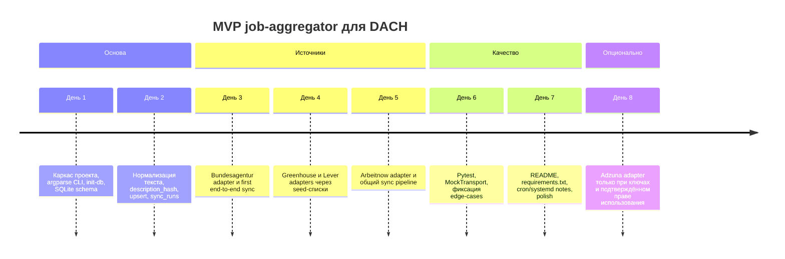

# Минимальный, но сильный job-aggregator для DACH

## Executive summary

Для MVP без UI у одного разработчика самый рациональный путь — не строить “универсальный скрапер всего подряд”, а сделать маленький ingestion-layer с несколькими **юридически нормальными** источниками, общей схемой нормализации и идемпотентным upsert в SQLite. Практически это означает: **Python 3.11+, `httpx`, `sqlite3`, `argparse`**, три базовые таблицы (`sources`, `jobs`, `sync_runs`), запуск по CLI и плановое обновление через cron/systemd timer. SQLite уже поддерживает `UPSERT` через `ON CONFLICT`, WAL-режим сохраняется на уровне файла БД, а `argparse` входит в стандартную библиотеку и сам генерирует help/usage; если нужна будущая миграция на Postgres, SQLAlchemy тоже умеет SQLite upsert через dialect-specific `insert().on_conflict_do_update()`. citeturn18search0turn18search1turn18search3turn18search6

По источникам картина жёсткая и довольно ясная. **Bundesagentur** — сильный базовый источник для Германии, потому что у него есть публичный search-flow и отдельный detail endpoint с полным описанием вакансии. **Greenhouse** и **Lever** — лучшие “company career pages” для MVP, потому что их job-board APIs специально предназначены для вывода опубликованных вакансий на кастомных career site’ах и отдают богатые поля без необходимости парсить DOM. **Arbeitnow** полезен как бесплатный европейский auxiliary feed, но это скорее courtesy/public API без явного SLA. **Adzuna** технически удобен, но юридически его надо считать **licensed/opt-in source**, а не core-source: стандартный Search API отдаёт только snippet описания, а Terms of Service ограничивают ongoing commercial aggregation без письменного согласия/лицензии после trial-периода. citeturn5view0turn17view0turn14view1turn15view0turn11search0turn13view0turn26view0turn1view4turn1view1

**AMS нельзя включать как автоматический источник.** На странице помощи AMS по “alle jobs” прямо сказано, что сервис предназначен только для собственной ручной job search, а автоматизированные механизмы для использования данных в своих целях запрещены. Поэтому корректный режим для AMS в этом MVP — **manual-link only**: пользователь может вставить ссылку, система может её сохранить как deeplink/metadata, но не синкать AMS по расписанию. citeturn21view0

Короткое ТЗ для MVP выглядит так: скрипт должен брать вакансии из **Bundesagentur, Greenhouse, Lever, Arbeitnow**, а **Adzuna** — только при наличии ключей и подтверждённого права использования; нормализовать записи в единый `JobNormalized`; хранить их в SQLite с exact upsert по `(source_name, external_id)`; считать `description_hash` и `dedup_key`; не делать hard-delete; логировать sync-run’ы; отдавать минимум CLI-команд: `init-db`, `sync`, `list-jobs`, `show-job`. Этого уже достаточно, чтобы потом поверх БД строить API/UI и AI-interview flow. citeturn5view0turn17view0turn15view0turn11search0turn18search0turn18search3

## Источники и их приоритет

Для интервью-платформы важнее не просто “количество карточек вакансий”, а **полнота и юридическая чистота описания вакансии**. Поэтому реальный порядок внедрения для MVP такой: **Bundesagentur → Greenhouse/Lever → Arbeitnow → Adzuna**. Причина простая: Bundesagentur и ATS-board sources дают полноценные описания и стабильные идентификаторы; Arbeitnow удобен как free feed, но без жёсткого SLA; Adzuna на базовом Search API отдаёт только snippet и требует лицензионной осторожности для постоянной коммерческой агрегации. citeturn5view0turn17view0turn15view0turn11search0turn26view0turn1view4

| Приоритет | Источник | Эндпоинты и пример запроса | Auth | Пагинация | Что реально приходит | Лимиты / SLA | Юридическая заметка | Роль в MVP |
|---|---|---|---|---|---|---|---|---|
| P0 | Bundesagentur Jobsuche | `GET /pc/v4/jobs?was=Python&wo=Berlin&page=1&size=50&angebotsart=1`, затем `GET /pc/v4/jobdetails/{base64(refnr)}` | `X-API-Key: jobboerse-jobsuche` | `page`, `size` | summary + отдельный detail c `titel`, `stellenangebotsBeschreibung`, `arbeitsorte`, `arbeitszeitmodelle`, `verguetung` | В retrieved OpenAPI явные quotas не опубликованы | Публично документированный search/detail flow; не лезть в scraping контактных данных | Базовый источник для DE |
| P1 | Greenhouse Job Board API | `GET https://boards-api.greenhouse.io/v1/boards/{board_token}/jobs?content=true` | На `GET` auth не нужен | В docs для jobs-list page param не документирован | `jobs[].id`, `title`, `content`, `departments`, `offices`, `absolute_url` | В retrieved Job Board docs GET-limits не указаны | API специально для кастомных career pages; published jobs публичны | Лучший direct-employer feed |
| P1 | Lever Postings API | `GET https://api.lever.co/v0/postings/{site}?mode=json&skip=0&limit=50` | Для чтения отдельный ключ не нужен; ключ нужен только для POST apply | `skip`, `limit` | `id`, `text`, `descriptionPlain`, `categories`, `hostedUrl`, `applyUrl`, `workplaceType`, optional `salaryRange` | Документирован лимит только для application POST — `429` после >2 POST/s | Published postings публичны; docs прямо говорят, что они publicly viewable | Лучший direct-employer feed |
| P2 | Arbeitnow API | `GET https://www.arbeitnow.com/api/job-board-api` | Нет API key | `links.next`, `meta.current_page` | `slug`, `company_name`, `title`, `description`, `remote`, `url`, `location` | Формальная quota не опубликована; в response meta есть “please do not abuse” | Free public API; у владельца есть paid private endpoint | Вспомогательный EU/DACH feed |
| P3 | Adzuna Search API | `GET /v1/api/jobs/{country}/search/{page}?app_id=...&app_key=...&what=data+analyst&content-type=application/json` | `app_id` + `app_key` | page path + `results_per_page` | `results[].id`, `title`, `company.display_name`, `redirect_url`, salary, **snippet** description | Default: 25/min, 250/day, 1000/week, 2500/month | Для ongoing commercial aggregation после 14-дневного trial может потребоваться письменное согласие/лицензия | Только licensed enrichment |

Сводка выше собрана из публичной документации Jobsuche API, Greenhouse Job Board API, Lever Postings API, Arbeitnow Free Job Search API и Adzuna Search API/ToS. Для Adzuna дополнительно важно, что их стандартный Search endpoint сам пишет: в response сейчас доступен только **snippet** описания, а на developer landing page отдельно предлагаются richer/commercial data products. citeturn5view0turn17view0turn14view1turn15view0turn15view1turn16search1turn11search0turn12view0turn13view0turn26view0turn1view4turn1view1

Практический вывод отсюда такой. **Bundesagentur** нужен первым, если вы хотите много вакансий по Германии с нормальными detail-records. **Greenhouse** и **Lever** нужны сразу после него, если важна direct-employer quality и “чистые” job descriptions для AI interview generation. **Arbeitnow** хорош как быстрый multiplier на старте. **Adzuna** стоит подключать только осознанно: либо как evaluation source на коротком trial, либо уже после получения лицензии. Для DACH это особенно важно, потому что у Adzuna есть локальные страны/домены для Austria, Germany и Switzerland, но ToS по ongoing use никуда не исчезают. citeturn5view0turn17view0turn15view0turn11search0turn1view4turn27view0

И ещё раз про AMS: в этом проекте его надо держать **вне sync-pipeline**. Никаких cron-задач, никаких массовых “копирований в нашу базу”, максимум — сохранить пользовательский deeplink типа `source_name='ams_manual'`, `source_url=...`, `is_manual=1`. Это не прихоть, а прямое следствие опубликованных условий AMS. citeturn21view0

## Схема данных SQLite

Для одного разработчика и одного файла БД нет смысла раздувать стек раньше времени. SQLite покрывает идемпотентный ingest через `ON CONFLICT`, WAL-режим помогает на сценариях “один писатель + много чтения”, а `argparse` даёт CLI без лишней зависимости. Если команда заранее знает, что через месяц уйдёт на Postgres, можно брать SQLAlchemy Core с его SQLite-specific upsert API; если нет — `sqlite3` проще и быстрее для MVP. citeturn18search0turn18search1turn18search6turn18search3

Нормализованная модель должна быть **чуть богаче**, чем голая карточка вакансии, потому что источники заметно различаются: у BA есть `refnr`, `arbeitsorte` и detail-поля на немецком; у Greenhouse — `content`, `departments`, `offices`; у Lever — `descriptionPlain`, `hostedUrl`, `applyUrl`, `workplaceType`; у Arbeitnow — `description`, `remote`, `url`, `location`; у Adzuna — `redirect_url`, salary-поля и только snippet description. Поэтому правильный минимум — не только title/company/location, но ещё `description_text`, `description_hash`, `raw_json`, `source_url`, `apply_url` и `dedup_key`. citeturn5view0turn17view0turn15view0turn12view0turn26view0

| Поле normalized job | Тип | Обязательность | Зачем нужно |
|---|---|---:|---|
| `source_name` | `TEXT` | да | Жёсткая provenance-привязка |
| `source_type` | `TEXT` | да | `api`, `ats`, `aggregator`, `manual` |
| `external_id` | `TEXT` | да | Exact identity внутри источника |
| `source_url` | `TEXT` | нет | Карточка вакансии / canonical job URL |
| `apply_url` | `TEXT` | нет | Прямая ссылка на apply, если есть |
| `title` | `TEXT` | да | Поисковая/UX-основа |
| `company` | `TEXT` | нет | Поиск, dedup, фильтры |
| `location_text` | `TEXT` | нет | Оригинальная строка локации |
| `city` | `TEXT` | нет | Нормализованный фильтр |
| `region` | `TEXT` | нет | Нормализованный фильтр |
| `country` | `TEXT` | нет | DACH-фильтр |
| `remote_type` | `TEXT` | нет | `remote`, `hybrid`, `onsite`, `unspecified` |
| `employment_type` | `TEXT` | нет | full-time/part-time/contract и т. п. |
| `salary_min` | `REAL` | нет | аналитика и фильтры |
| `salary_max` | `REAL` | нет | аналитика и фильтры |
| `salary_currency` | `TEXT` | нет | валюта |
| `salary_is_predicted` | `INTEGER` | нет | не путать прогноз и факт |
| `date_posted` | `TEXT` | нет | сортировка по свежести |
| `date_updated_source` | `TEXT` | нет | понимать churn источника |
| `description_text` | `TEXT` | нет | база для interview generation |
| `description_hash` | `TEXT` | нет | быстрый change detection |
| `dedup_key` | `TEXT` | нет | мягкая межисточниковая дедупликация |
| `language` | `TEXT` | нет | `de`, `en` и т. п. |
| `raw_json` | `TEXT` | да | безопасное сохранение оригинала |

Минимальная SQLite-схема может оставаться в трёх таблицах.

| Таблица | Ключевые поля | Зачем нужна |
|---|---|---|
| `sources` | `name`, `source_type`, `base_url`, `is_active` | Справочник и включение/выключение адаптеров |
| `jobs` | normalized-поля + `first_seen_at`, `last_seen_at`, `is_active` | Основное хранилище вакансий |
| `sync_runs` | `source_name`, `started_at`, `finished_at`, `status`, `jobs_seen`, `inserted`, `updated`, `deactivated`, `error` | Наблюдаемость и дебаг |

Практически важные ограничения и индексы должны быть такими:

```sql
CREATE UNIQUE INDEX uq_jobs_source_ext
ON jobs(source_name, external_id);

CREATE INDEX ix_jobs_dedup_key
ON jobs(dedup_key);

CREATE INDEX ix_jobs_country_city_active
ON jobs(country, city, is_active);
```

`(source_name, external_id)` — это hard identity. У целевых источников он естественно есть: BA даёт `refnr`, Greenhouse — `id`, Lever — `id`, Adzuna — `id`, Arbeitnow — `slug` и `url`. Всё, что сложнее, надо считать **soft dedup**, а не primary key. citeturn5view0turn17view0turn23view0turn26view0turn12view0

Если хочется совсем короткий вариант ТЗ для БД, то он такой: **хранить exact-source identity, нормализованный текст вакансии, provenance и sync telemetry**. Всё остальное можно добросить позже, не ломая контракт. Это намного устойчивее, чем пытаться “сразу склеить все вакансии мира в одну canonical table без потерь”. citeturn5view0turn17view0turn15view0turn12view0turn26view0

## Алгоритм синхронизации

Синк должен быть **source-aware**, а не одинаковым для всех. У BA правильный flow — поиск через `/pc/v4/jobs`, затем detail-fetch по `base64(refnr)`. У Greenhouse detail-fetch для описания часто не нужен, потому что `?content=true` уже даёт полное содержимое поста. У Lever list-endpoint уже возвращает богатый JSON для опубликованных вакансий. Arbeitnow отдаёт paginated feed с `links.next`. Adzuna — page-based search, но на базовом Search API description остаётся snippet. citeturn5view0turn17view0turn15view0turn12view0turn13view0turn26view0

Рекомендованный алгоритм для MVP:

1. **Загрузить конфиг источника и scope.**  
   Для BA scope — это query/location seed, для Greenhouse и Lever — список `board_token`/`site`, для Arbeitnow — глобальный feed или ограниченный page range, для Adzuna — query + country. Для company ATS-источников лучше держать seed-списки руками, а не “искать все карьеры интернета” широким crawling. Greenhouse и Lever сами документируют `board_token`/`site` как часть публичного URL/API namespace. citeturn14view1turn15view0

2. **Забрать страницы источника с консервативной пагинацией.**  
   BA использует `page/size`, Lever — `skip/limit`, Arbeitnow — `links.next`, Adzuna — page в path и `results_per_page`. Нужно жёстко ограничивать максимум страниц на один прогон, чтобы не убивать ни API, ни свою SQLite-задачу. citeturn5view0turn15view1turn13view0turn26view0

3. **Где нужно, дотянуть детали по вакансии.**  
   BA требует отдельный detail-call по `refnr`. Greenhouse при `content=true` уже даёт контент и office/department, поэтому N+1 в большинстве случаев не нужен. Lever в read-only сценарии обычно тоже не требует отдельного “job detail round-trip” для ingestion. citeturn5view0turn17view0turn15view0turn23view0

4. **Нормализовать поля в общий `JobNormalized`.**  
   На этом шаге надо привести разнородные поля к одной форме: URL’ы, текст локации, salary, remote/hybrid/onsite, posted date, description_text. Для HTML/HTML-like описаний нужен deterministic text-cleaning: unescape HTML entities, убрать теги, схлопнуть whitespace. Источники действительно отдают контент по-разному: Greenhouse `content`, Lever `descriptionPlain`/`description`, Arbeitnow HTML-ish text, Adzuna snippet. citeturn17view0turn23view0turn12view0turn26view0

5. **Посчитать два ключа: `description_hash` и `dedup_key`.**  
   `description_hash` нужен для change detection внутри одной и той же вакансии; `dedup_key` — для мягкой межисточниковой дедупликации. Нормальный MVP-формат для `dedup_key`: `slug(title)|slug(company)|slug(city_or_region)|sha1(first_500_chars(description_text))`. Важно: **не удалять** записи только на основе `dedup_key`; использовать его для группировки и пометки дублей. Это снижает риск “слипнуть” разные вакансии с похожими названиями.

6. **Сделать exact upsert в SQLite.**  
   Если `(source_name, external_id)` уже существует — обновить изменяемые поля, `description_hash`, `last_seen_at`, `is_active=1`. Если нет — вставить новую запись с `first_seen_at=now`, `last_seen_at=now`. SQLite для этого как раз и хорош: один statement через `ON CONFLICT DO UPDATE`. citeturn18search0

7. **Разруливать деактивацию аккуратно, а не тупо “не пришло в этом ранe — значит умерло”.**  
   Для **full-board sources** это допустимо: Greenhouse job board endpoint возвращает список всех опубликованных job posts данного board’а, Lever — published job postings данного site. Поэтому если вы сделали **успешный полный sweep** board/site, можно помечать исчезнувшие записи `is_active=0`. Для **query-based sources** вроде BA и Adzuna этого делать нельзя: отсутствие в конкретном query scope не доказывает, что вакансия исчезла глобально. Для них MVP должен ограничиться `last_seen_at` и меткой stale, а не hard inactivation после одного пропуска. citeturn14view1turn15view0turn5view0turn26view0

8. **Логировать каждый прогон в `sync_runs`.**  
   Нужны хотя бы `status`, `jobs_seen`, `inserted`, `updated`, `deactivated`, `error`. Без этого ты не поймёшь, источник реально пустой, ты упёрся в 429/403, или нормализатор отвалился на одном поле.

Ретрай и backoff надо держать тупо и надёжно: retry только на `408`, `429`, `5xx` и сетевых исключениях; максимум 3–4 попытки; backoff `1s, 2s, 4s + jitter`; на `4xx`, кроме `408/429`, не ретраить. Для Adzuna это особенно важно из-за документированных лимитов, для Arbeitnow — из-за courtesy-режима “please do not abuse”, для Greenhouse/Lever — просто потому что вы гость на чужом public board API. citeturn1view4turn13view0turn17view0turn15view0

Рекомендованный cadence для MVP без очередей и без Celery выглядит так:

| Источник | Cadence | Почему |
|---|---|---|
| Bundesagentur | каждые 30–60 минут по фиксированным query seeds | основной DE-source, но query-based |
| Greenhouse / Lever | 2–4 раза в день по seed-спискам компаний | direct-employer boards меняются не каждую минуту |
| Arbeitnow | каждые 3–6 часов | free public feed без явного SLA |
| Adzuna | 1–2 раза в день на free keys; чаще только по лицензии | default daily quota низкая |
| Cleanup / stale marking | 1 раз в день | не смешивать с ingest loop |

Эти интервалы — инженерная рекомендация, но они жёстко согласуются с тем, что Adzuna публикует низкие default quotas, Arbeitnow просит не абьюзить public API, а Greenhouse/Lever job-board docs вообще не обещают вам “датасентр для массированного polling”. citeturn1view4turn13view0turn17view0turn15view0

## Структура проекта и CLI

Для MVP нужен не framework zoo, а внятный каркас файлов. Если делать совсем по-умному и без лишней магии, структура может быть такой:

```txt
jobagg/
  __init__.py
  main.py
  config.py
  db.py
  normalizer.py
  hashing.py
  sources/
    __init__.py
    base.py
    bundesagentur.py
    greenhouse.py
    lever.py
    arbeitnow.py
    adzuna.py
  seeds/
    greenhouse.txt
    lever.txt
  tests/
    test_hashing.py
    test_upsert.py
    test_bundesagentur.py
    test_greenhouse.py
    test_lever.py
README.md
requirements.txt
```

`argparse` здесь достаточно, потому что он уже умеет обязательные/необязательные аргументы, help-месседжи и валидацию ошибок ввода. Для маленького sync-инструмента это лучше, чем тянуть ещё один уровень abstraction только ради красоты. citeturn18search3

| Файл | Содержимое |
|---|---|
| `main.py` | CLI entrypoint, subcommands, wiring |
| `config.py` | env vars, timeouts, user-agent, api keys |
| `db.py` | создание таблиц, upsert, select helpers |
| `normalizer.py` | маппинг raw source payload → `JobNormalized` |
| `hashing.py` | `normalize_text`, `description_hash`, `dedup_key` |
| `sources/base.py` | `BaseJobSource` и общие сетевые helpers |
| `sources/bundesagentur.py` | list → detail flow по `refnr` |
| `sources/greenhouse.py` | board job fetch через `content=true` |
| `sources/lever.py` | paginated fetch по `skip/limit` |
| `sources/arbeitnow.py` | paginated free feed |
| `sources/adzuna.py` | licensed/trial-only adapter |
| `seeds/*.txt` | вручную поддерживаемые board tokens / site names |
| `tests/*` | unit + integration tests |
| `README.md` | setup, env vars, команды, ограничения |
| `requirements.txt` | минимальные runtime/dev зависимости |

Если выбрать **самую маленькую** реализацию, `requirements.txt` может быть реально коротким:

```txt
httpx>=0.27,<1
pytest>=8,<9
```

Если нужен более “enterprise-looking” вариант, можно добавить:

```txt
sqlalchemy>=2.0,<3   # optional
pydantic>=2.0,<3     # optional
```

Именно optional, а не mandatory: SQLite и stdlib уже закрывают MVP. Подключать SQLAlchemy есть смысл тогда, когда вы осознанно хотите абстракцию БД и дорожку к Postgres; его SQLite dialect upsert это умеет. citeturn18search6

Минимальный CLI-контракт я бы зафиксировал так:

```bash
python -m jobagg init-db

python -m jobagg sync bundesagentur \
  --query "backend developer" \
  --location "Berlin" \
  --pages 3 \
  --days 7

python -m jobagg sync greenhouse \
  --seed-file jobagg/seeds/greenhouse.txt

python -m jobagg sync lever \
  --seed-file jobagg/seeds/lever.txt

python -m jobagg sync arbeitnow \
  --pages 5

python -m jobagg sync adzuna \
  --country de \
  --query "data analyst" \
  --pages 2
# только если у вас есть app_id/app_key и право использования

python -m jobagg list-jobs --country DE --limit 20
python -m jobagg show-job --id 42
```

Этого уже хватает для deliverables, которые ты просил: **минимальные working script files, README, requirements.txt, example CLI commands**. А если позже появится API/UI, эти же команды останутся как ingestion backend и не пойдут в мусор. citeturn18search3turn18search0

## Кодовые фрагменты

Ниже — не “игрушечные” куски, а именно тот skeleton, с которого реально стоит стартовать. Он опирается на официальный BA flow `jobs → jobdetails(base64(refnr))` и на SQLite `ON CONFLICT` semantics. citeturn5view0turn18search0

```python
# jobagg/sources/base.py
from __future__ import annotations

from abc import ABC, abstractmethod
from typing import Iterable, Iterator, Any

class BaseJobSource(ABC):
    name: str

    @abstractmethod
    def fetch(self, **kwargs: Any) -> Iterator[dict]:
        """Yield normalized jobs as dictionaries."""
        raise NotImplementedError

    @staticmethod
    def iter_pages(items: Iterable[dict]) -> Iterator[dict]:
        for item in items:
            yield item
```

Для Bundesagentur минимально правильная реализация должна делать именно **два шага**: сначала search, потом detail по `refnr`. Не пытайся жить только на search-summary, потому что тогда ты теряешь полное описание вакансии — а это убивает downstream interview generation. citeturn5view0

```python
# jobagg/sources/bundesagentur.py
from __future__ import annotations

import base64
import time
from typing import Iterator

import httpx

from jobagg.hashing import clean_text, description_hash, build_dedup_key


class BundesagenturSource:
    name = "bundesagentur"
    base_url = "https://rest.arbeitsagentur.de/jobboerse/jobsuche-service"

    def __init__(self, client: httpx.Client | None = None) -> None:
        self.client = client or httpx.Client(
            timeout=httpx.Timeout(20.0, connect=5.0),
            headers={
                "X-API-Key": "jobboerse-jobsuche",
                "Accept": "application/json",
                "User-Agent": "jobagg/0.1 (+contact: you@example.com)",
            },
        )

    def _get_json(self, url: str, params: dict | None = None, retries: int = 3) -> dict:
        last_err = None
        for attempt in range(retries):
            try:
                resp = self.client.get(url, params=params)
                if resp.status_code in (408, 429, 500, 502, 503, 504):
                    raise httpx.HTTPStatusError(
                        f"retryable status={resp.status_code}",
                        request=resp.request,
                        response=resp,
                    )
                resp.raise_for_status()
                return resp.json()
            except Exception as exc:
                last_err = exc
                if attempt == retries - 1:
                    raise
                time.sleep((2 ** attempt) + 0.2)
        raise RuntimeError("unreachable") from last_err

    def _detail(self, refnr: str) -> dict:
        encoded = base64.b64encode(refnr.encode("utf-8")).decode("ascii")
        url = f"{self.base_url}/pc/v4/jobdetails/{encoded}"
        return self._get_json(url)

    def fetch(
        self,
        query: str,
        location: str | None = None,
        days: int = 7,
        pages: int = 1,
        size: int = 50,
    ) -> Iterator[dict]:
        for page in range(1, pages + 1):
            data = self._get_json(
                f"{self.base_url}/pc/v4/jobs",
                params={
                    "was": query,
                    "wo": location,
                    "page": page,
                    "size": size,
                    "angebotsart": 1,          # ARBEIT
                    "veroeffentlichtseit": days,
                },
            )
            for job_stub in data.get("stellenangebote", []):
                refnr = job_stub["refnr"]
                detail = self._detail(refnr)

                title = detail.get("titel") or detail.get("stellenangebotsTitel") or job_stub.get("beruf")
                company = detail.get("arbeitgeber") or job_stub.get("arbeitgeber")
                desc = clean_text(detail.get("stellenangebotsBeschreibung") or detail.get("stellenbeschreibung") or "")

                # BA detail may expose arbeitsorte[]; fall back to summary arbeitsort
                places = detail.get("arbeitsorte") or []
                first_place = places[0] if places else (job_stub.get("arbeitsort") or {})

                city = first_place.get("ort")
                region = first_place.get("region")
                country = first_place.get("land") or "DE"
                location_text = ", ".join([p for p in [city, region, country] if p])

                yield {
                    "source_name": self.name,
                    "source_type": "api",
                    "external_id": refnr,
                    "source_url": job_stub.get("externeUrl"),
                    "apply_url": job_stub.get("externeUrl"),
                    "title": title,
                    "company": company,
                    "location_text": location_text or None,
                    "city": city,
                    "region": region,
                    "country": country,
                    "remote_type": "unspecified",
                    "employment_type": ",".join(detail.get("arbeitszeitmodelle") or []),
                    "salary_min": None,
                    "salary_max": None,
                    "salary_currency": "EUR" if detail.get("verguetung") else None,
                    "salary_is_predicted": None,
                    "date_posted": detail.get("aktuelleVeroeffentlichungsdatum"),
                    "date_updated_source": detail.get("modifikationsTimestamp"),
                    "description_text": desc,
                    "description_hash": description_hash(desc),
                    "dedup_key": build_dedup_key(title, company, city or region, desc),
                    "language": "de",
                    "raw_json": {"search": job_stub, "detail": detail},
                }
```

Хеш описания должен считаться **после** приведения HTML/whitespace к стабильному plain-text виду, иначе ты получишь фальшивые “изменения” при любой косметике источника. Это особенно важно для Greenhouse, Lever и Arbeitnow, где контент либо HTML, либо HTML-like. citeturn17view0turn23view0turn12view0

```python
# jobagg/hashing.py
from __future__ import annotations

import hashlib
import html
import re


_TAG_RE = re.compile(r"<[^>]+>")
_WS_RE = re.compile(r"\s+")


def clean_text(value: str | None) -> str:
    if not value:
        return ""
    value = html.unescape(value)
    value = _TAG_RE.sub(" ", value)
    value = _WS_RE.sub(" ", value).strip()
    return value


def description_hash(text: str) -> str:
    normalized = clean_text(text).lower()
    return hashlib.sha256(normalized.encode("utf-8")).hexdigest()


def _slug(text: str | None) -> str:
    text = clean_text(text).lower()
    text = re.sub(r"[^a-z0-9а-яёäöüß]+", "-", text, flags=re.IGNORECASE)
    return text.strip("-")


def build_dedup_key(title: str | None, company: str | None, place: str | None, desc: str | None) -> str:
    head = f"{_slug(title)}|{_slug(company)}|{_slug(place)}"
    tail = hashlib.sha1(clean_text(desc)[:500].lower().encode("utf-8")).hexdigest()
    return f"{head}|{tail}"
```

Самый компактный и надёжный upsert для MVP — прямо через `sqlite3` и единственный `INSERT .. ON CONFLICT DO UPDATE`. Если позже захочешь ORM, логика останется та же, просто синтаксис переедет в SQLAlchemy SQLite dialect. citeturn18search0turn18search6

```python
# jobagg/db.py
from __future__ import annotations

import json
import sqlite3
from typing import Any


UPSERT_SQL = """
INSERT INTO jobs (
    source_name, source_type, external_id, source_url, apply_url,
    title, company, location_text, city, region, country,
    remote_type, employment_type,
    salary_min, salary_max, salary_currency, salary_is_predicted,
    date_posted, date_updated_source,
    description_text, description_hash, dedup_key, language,
    raw_json, first_seen_at, last_seen_at, is_active
) VALUES (
    :source_name, :source_type, :external_id, :source_url, :apply_url,
    :title, :company, :location_text, :city, :region, :country,
    :remote_type, :employment_type,
    :salary_min, :salary_max, :salary_currency, :salary_is_predicted,
    :date_posted, :date_updated_source,
    :description_text, :description_hash, :dedup_key, :language,
    :raw_json, CURRENT_TIMESTAMP, CURRENT_TIMESTAMP, 1
)
ON CONFLICT(source_name, external_id) DO UPDATE SET
    source_type = excluded.source_type,
    source_url = excluded.source_url,
    apply_url = excluded.apply_url,
    title = excluded.title,
    company = excluded.company,
    location_text = excluded.location_text,
    city = excluded.city,
    region = excluded.region,
    country = excluded.country,
    remote_type = excluded.remote_type,
    employment_type = excluded.employment_type,
    salary_min = excluded.salary_min,
    salary_max = excluded.salary_max,
    salary_currency = excluded.salary_currency,
    salary_is_predicted = excluded.salary_is_predicted,
    date_posted = excluded.date_posted,
    date_updated_source = excluded.date_updated_source,
    description_text = excluded.description_text,
    description_hash = excluded.description_hash,
    dedup_key = excluded.dedup_key,
    language = excluded.language,
    raw_json = excluded.raw_json,
    last_seen_at = CURRENT_TIMESTAMP,
    is_active = 1
"""


def upsert_job(conn: sqlite3.Connection, job: dict[str, Any]) -> None:
    payload = dict(job)
    payload["raw_json"] = json.dumps(payload["raw_json"], ensure_ascii=False)
    conn.execute(UPSERT_SQL, payload)
```

Этого кода уже достаточно, чтобы сделать первую рабочую вертикаль: `init-db → sync bundesagentur → list-jobs`. После этого любые остальные source adapters подключаются по той же схеме. citeturn5view0turn18search0

## Тестирование, безопасность и деплой

Для этого проекта тесты не должны быть “после когда-нибудь”, потому что почти весь риск здесь — в integration boundary: pagination, rate-limit behavior, idempotent upsert, HTML normalization. `pytest` хорошо подходит для маленьких читаемых тестов, а `httpx` позволяет подменить сеть через `MockTransport`, так что интеграционные тесты можно гонять без реальных вызовов внешних API. citeturn19search2turn19search5

Минимальный тест-пакет должен быть таким:

| Тест | Что проверяет |
|---|---|
| `test_description_hash_stable()` | одинаковый hash при разном HTML/whitespace |
| `test_upsert_idempotent()` | второй sync того же job не создаёт дубль |
| `test_ba_search_then_detail_flow()` | BA adapter действительно ходит list → detail |
| `test_greenhouse_content_true_maps_description()` | `content=true` нормально попадает в `description_text` |
| `test_lever_pagination_stops()` | loop по `skip/limit` корректно завершается |
| `test_arbeitnow_next_link_pagination()` | `links.next` обрабатывается без зацикливания |
| `test_sync_run_logging()` | ошибки и counters пишутся в `sync_runs` |
| `test_sqlite_integration_roundtrip()` | полный local ingest в temp SQLite реально работает |

Юридический и security checklist для этого MVP короткий, но игнорировать его — прямой способ словить себе проблему на пустом месте.

| Чек | Почему это обязательно |
|---|---|
| **Не автоматизировать AMS** | AMS прямо запрещает automated mechanisms для `alle jobs`; только manual link support |
| **Не считать Adzuna “свободным production-source” по умолчанию** | Terms of Service ограничивают ongoing commercial/aggregated use после 14-дневного trial без письменного согласия/лицензии |
| **Не собирать контактные данные, защищённые anti-crawling механизмами** | BA прямо пишет, что контакты в портале защищаются CAPTCHA от unerlaubtem Daten-Crawling |
| **Не использовать application POST endpoints из того же ingest-сервиса** | Greenhouse и Lever отделяют job listing APIs от application submission; для MVP нужен только read-only ingest |
| **Хранить provenance** | `source_name`, `source_url`, `raw_json`, `last_seen_at` нужны для аудита, разборов и takedown/cleanup |
| **Держать ключи вне CLI history** | `ADZUNA_APP_ID`, `ADZUNA_APP_KEY` должны идти через env vars, не через shell history |
| **Включить WAL и делать бэкап файла БД** | SQLite WAL упрощает read/write режим, а `.db` файл надо копировать/бэкапить регулярно |

Основание для этого checklist’а — опубликованные правила AMS, ToS Adzuna, privacy note BA и разделение read/apply endpoints в Greenhouse/Lever docs. citeturn21view0turn1view4turn25search0turn17view0turn14view1turn15view0turn16search1turn18search1

По деплою не надо выдумывать “распределённую платформу вакансий” в день первый. Для MVP хватит: один Python process, `.env`, SQLite на persistent volume, `PRAGMA journal_mode=WAL`, запуск по cron или systemd timer, nightly backup файла БД. Trigger.dev/Celery можно оставить на потом, когда появятся десятки источников, большая очередь задач или нужда в retry orchestration между машинами. До этого момента это лишний вес. WAL при этом официально является persistent режимом SQLite, так что его достаточно включить один раз на файле БД. citeturn18search1turn18search5

## Дорожная карта

Ниже — реалистичный план на одного разработчика. Не “идеальный”, а нормальный живой план, при котором к концу недели у тебя уже есть working ingest, а не только красивый README.



Definition of done для этого MVP должна быть максимально приземлённой. Готово считается то, что:  
`python -m jobagg init-db` создаёт схему;  
`python -m jobagg sync bundesagentur ...` реально пишет записи в SQLite;  
`python -m jobagg sync greenhouse/lever/arbeitnow` работает по тем же правилам;  
повторный sync не плодит дубликаты;  
`list-jobs` и `show-job` читают данные;  
README объясняет env vars, команды и legal ограничения;  
в репозитории есть хотя бы базовые integration tests.  

Это и есть нормальный “очень маленький, но мощный” агрегатор: без UI, без фреймворк-цирка, но уже с правильной архитектурой под дальнейший interview-product.